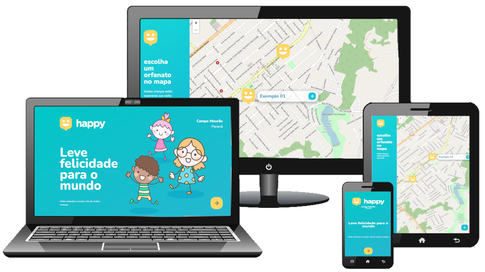

 <h1 align = "center">
🔋🚀 NLW3-HappyProject
</h1>

 

    <h1>
      <strong style = "font-size: 150px"> HAPPY</Strong> 
   
 
 

Project developed at <i><b>"The next level week #3"</b></i>

## 🏁 Objetive

Develop a project with front-end, back-end and database in one week.

## 💻 This project was developed with:

- Handlebars

- CSS 3

- JavaScript

- Node.js

- Express

- SQLite

## 🚀 Project Rockeatseat

- [GitHub NLW #3](https://github.com/guilhermecapitao/nlw3-discovery-happy)

## 📝 Mit license

More details: [License](/LICENSE)

# 🎬 [ALL CREDITS TO _ROCKETSEAT_](https://rocketseat.com.br)

# 🎬 [TODOS OS CRÉDITOS A _ROCKETSEAT_](https://rocketseat.com.br)